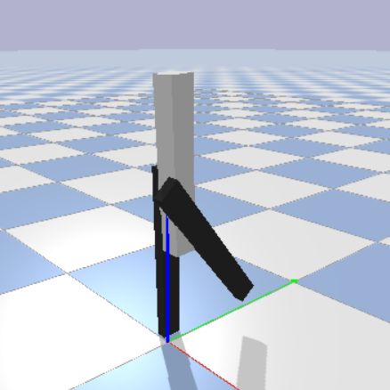
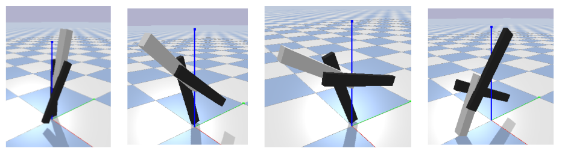
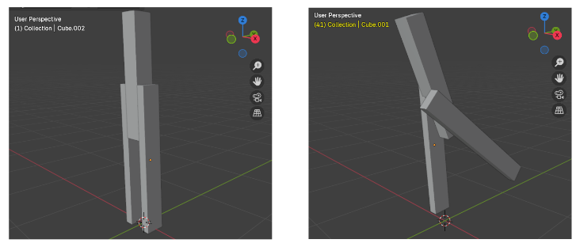
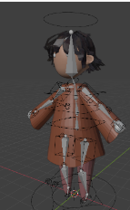

# sim-falling-animation
Simulating controlled falling motion of a simplified humanoid model for 3d animation

## Abstract
This project uses PyBullet to simulate controlled falling motion for a simple, 3-link humanoid robot model, in order to achieve stylised yet accurate falling mechanics for 3d animation. Parameters like the initial state or initial velocity can be provided to the model, and the final simulation can be ported over to Blender using the PyBullet Blender Recorder. LQR is used as the controller for balancing.

## Introduction
The aim of this project is to use simulation to help animate falling motion.
Animating can be very time-intensive, and getting the dynamics of physics-heavy behaviours like falling can be difficult to do entirely by hand, which makes approaches like simulation or motion capture useful tool. However, relying largely on motion capture data or simulating a motion with minimal adjustment can reduce the amount of creative freedom available to the animator in making stylised animations.
By using a simulation-based approach that is tailored to a specific action, falling, and with customisable parameters, this approach could work in helping create a more realistic falling animation than just posing the system manually, while also not sacrificing the potential for more
stylisation and creative freedom.
The approach to this was informed by previous works using simulation approaches as part of animating or controlling humanoid figures, e.g. [1] and [2]. 

## Implementation
### Model and state definitions
The model used to simulate this was a 3-link robot with a torso and 2 legs (see image below from PyBullet for reference). This was set up in PyBullet with appropriate parameters - mass was assigned based on the average human weight of 60kg, in a standard ratio roughly matching body weight distribution of 60%-20%-20% for the torso and limbs for maximum accuracy.

The state of the model was defined using:
- 3 rotations (torso, l_leg, r_leg)
- 3 angular velocities (torso, l_leg, r_leg)

The goal position was defined as the unstable equilibrium where all rotations were at 0, i.e. the biped is standing fully upright.

### Control
An LQR controller is used to implement balancing.
The standard LQR formulation for the new state of the robot is $x_k = Ax + Bu$.
$x$ here is the previous state of the robot as defined above.
$u$ is the control law - this is defined as the error in the state, i.e. how far the current state is from the goal upright position. As balancing is occuring mainly around the equilibrium position, it can be assumed that this is approximately linear. 
The Jacobian matrices for the state and control law respectively, A and B, are then used to calculate an LQR gains matrix K. The Python 'control' library's control.lqr function [3] is used instead of manually implemented a differential equation solver.

#### Feedback
The new state of the robot is hence implemented in simulation as setting the velocity of the motors in the simulation, $\dot{x}$, based on the current state and the error in state u, with LQR gains as coefficients.

This is applied to control the torso and 1 of the limbs for balancing - the control is divided as:
- negative feedback on 1 of the legs, leaning away from the falling direction
- smaller amount of positive feedback on the torso, leaning towards the falling direction

#### Tuning K
While the initial values of K are obtained to get optimal balancing, an input is included in the simulation to adjust the values of this matrix - these allow for modifying the control to get over or undercorrection, resulting in different balancing/falling speeds and dynamics.

### Implementation
#### Simulation in Pybullet
These were then simulated in Pybullet to obtain simulations of falling motion, with different dynamics controlling the falls. The image below shows some snapshots from a sequence with too strong feedback, showing the tipping sequence as the leg and body overcorrect, resulting in oscillation and tipping over.

#### Porting to Blender
A blender model was set up matching the basic rig in the simulator.
The PyBullet Blender recorder was used to port over the simulation into a Blender file as keyframed animation, which then allowed for an animation of the motion - see image below for pose matching.

A pre-rigged model with inverse kinematics set up in Blender as pictured below, which was used as a rough reference for height/limb ratios involved when setting up the model, was then used to copy the parameters to for an animated motion.

## Reflections
A lot of the complexity in this project arose from figure out the state equations and control setup for the simplified biped model I was using, i.e. the 3-link robot. This wasn't a common configuration used by resources online demonstrating/implementing LQR control, and I was only able to find references to it in research papers, where the details weren't explicitly set out, more parameters were used (e.g. [1] uses ball joints instead of just single axis rotation), and some of the dynamics discussed were too complex for me to figure out. 
My final approahc to this was based on a combination of 2 link 'acrobot' style robot dynamics, and by simplifying the model to not control the 2nd leg at all and instead just letting it be the support system.
My largest takeaway at the moment though would be to start the documentation process well in advance, though, especially collecting any data needed, as it takes a good amount of time to write documentation and there is a lot that can go wrong with leaving data collection and recordings to the last minute.

[1] Marco, Y. Abe, and J. Popović, “Interactive simulation of stylized human locomotion,” DSpace@MIT (Massachusetts Institute of Technology), Aug. 2008, doi: https://doi.org/10.1145/1399504.1360681.
‌[2] K. YAMANE, J. K. HODGINS, and H. B. BROWN, “CONTROLLING A MOTORIZED MARIONETTE WITH HUMAN MOTION CAPTURE DATA,” International Journal of Humanoid Robotics, vol. 01, no. 04, pp. 651–669, Dec. 2004, doi: https://doi.org/10.1142/s0219843604000319.
[3] https://python-control.readthedocs.io/en/latest/generated/control.lqr.html
‌
